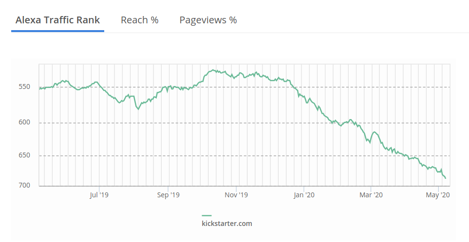

## Table of contents
* [General info](#general-info)
* [Technologies](#technologies)
* [Setup](#setup)

## General info
This is a personal project that I wan to convert to a library.  The objective is to create a Kickstarter tracker that allows you to follow a list of projects and save their information once a day (to keep track of the development of the project). It will transform that information to create predictive models and apply Machine Learning.
Here are the steps we want to consider to build the Kickstarter tracker:
1. Download data using my filesystem that allows the user to execute and save web scraping data from
recent Kickstarter campaigns.
2. Have control of the execution and recollection of data using google instances.
3. Analyze and clean that information.
4. Incorporate previous information (Collected data, monthly reported) for a better analysis or create more robust models
5. Create a forecast model out of the recollected data.
6. If we have enough time, we will deploy that model with flask to create an app.


## Why?

I'm launching my Kickstarter campaign, and I'm worried because it seems that Kickstarter traffic is being affected by COVID19
I want to have as precise information as possible to take the best strategy for my campaign. I think it is an excellent problem case
that will involve many tasks in python until we reach our final product; A model that makes a prediction and allows us
to see data and forecasts in real-time. I'm a Data Scientist,and I also work in the consultancy sector. I'm trying to advance as fast as possible to create an MVP that let me test the full version of the app, and then I will invest more time in creating a quality application.
I'm not good following the Documenting Python Code, but I'm trying to improve and learn as I develop this project, any
suggestion or feedback is encouraged.
If anyone is interested in developing this kind of
skills (Forecast, Data collection, automatization), this is a good way to start. After completing my objective, I will update and improve my code
to build a more robust and friendly user app. If you stick to the project, I will describe the evolution of the project in the commits and documentation.




## Technologies
Project is created with:
* Python: 3.7.3

## Setup


```
$ cd ../python-kickstarter-track
$ python 0_script.py
$ python 1_script.py
```

